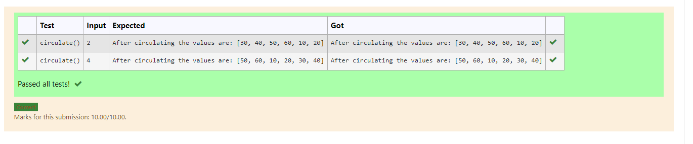

# Circulate-the-values-of-N-variables
## Aim:
To write a python program to circulate the n variables using function concept
## Equipment’s required:
PC
Anaconda - Python 3.7
## Algorithm: 
### Step 1: 
Define circulate()
### Step 2: 
Assign the values as a list
### Step 3: 
Get the value from the user for the number of rotation
### Step 4: 
Using the slicing concept rotate the list
### Step 5: 
Assign a variable after slicing and print the value
### Step 6: 
End the program
## Program:
```
#Program to circulate N values.
#Developed by: Senthil Kumar S
#RegisterNumber: 21500410
def circulate():
    l=[10,20,30,40,50,60]
    n=int(input())
    a=l[n:]+l[:n]
    print("After circulating the values are:",a)
```
## Output:


## Result:
Thus circulating the n values are successfully executed
